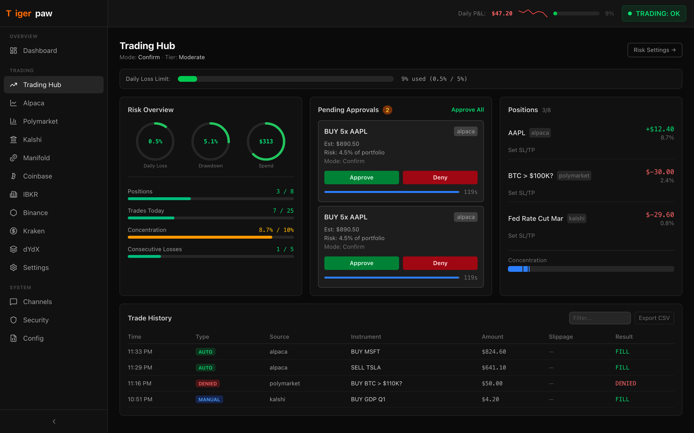
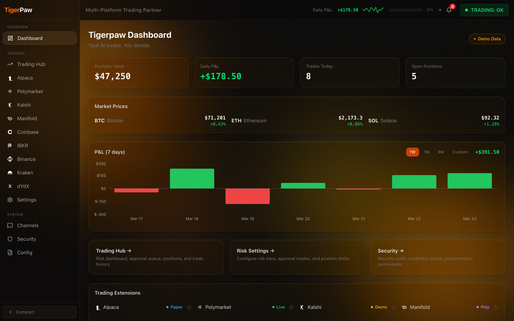
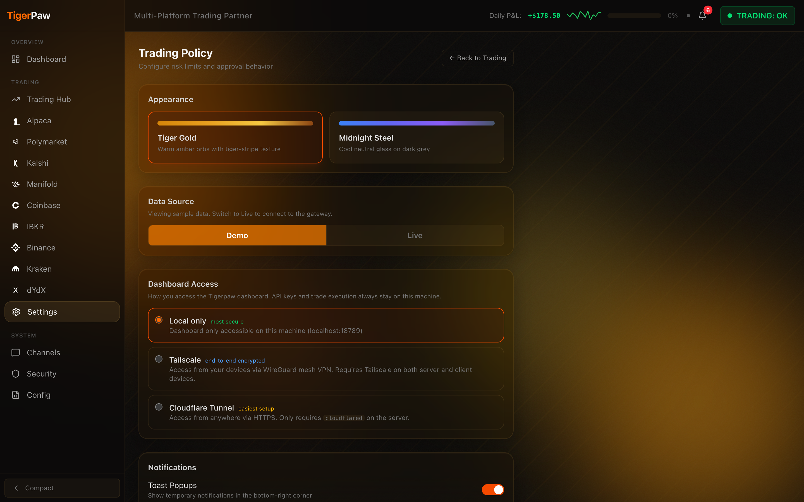
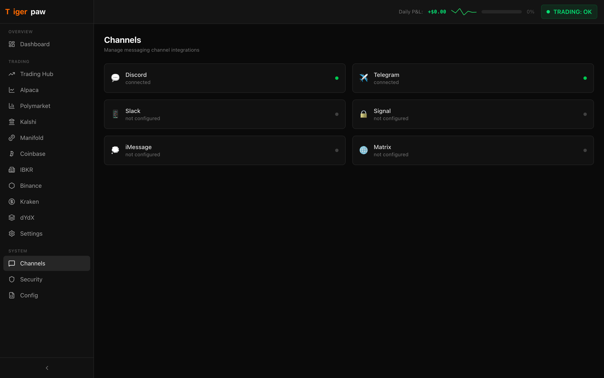
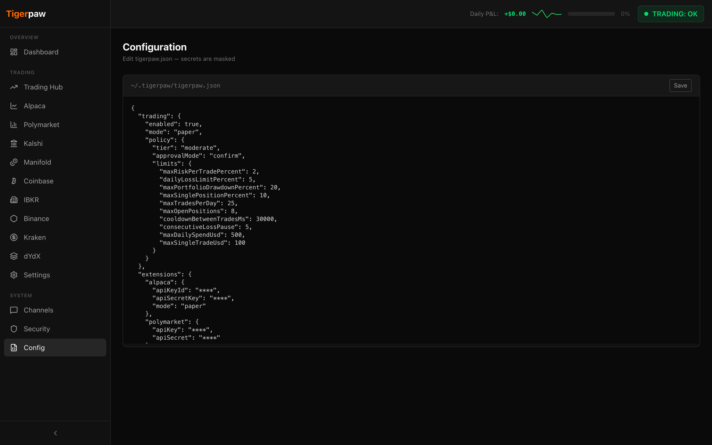
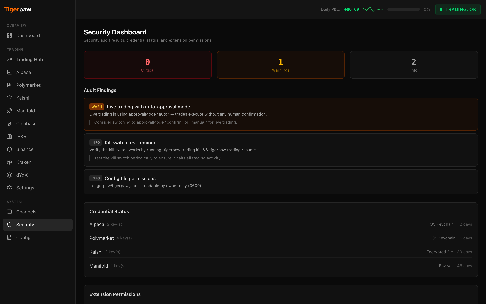

<p align="center">
  
</p>

<h1 align="center">Tigerpaw</h1>

<p align="center">
  Everything OpenClaw does -- 20+ messaging channels, AI agent runtime, plugin system -- plus a trading engine, security hardening, a modern React 19 dashboard, and real-time notifications. Local-first by default.
</p>

<p align="center">
  <a href="https://www.npmjs.com/package/@greatlyrecommended/tigerpaw"></a>
  <a href="https://github.com/varunrazdan/tigerpaw/actions/workflows/ci.yml"></a>
  <a href="https://github.com/varunrazdan/tigerpaw/blob/main/LICENSE"></a>
  = 22" />
</p>

---

## Table of Contents

- [Features](#features)
- [Why Tigerpaw?](#why-tigerpaw)
- [Support](#support)
- [Screenshots](#screenshots)
- [Install](#install)
- [Quick Start](#quick-start)
- [Configuration](#configuration)
  - [Environment Variables](#environment-variables)
  - [Trading Setup](#trading-setup)
  - [Trading Config Reference](#trading-config-reference)
  - [Trading Platforms](#trading-platforms)
  - [Risk Tiers](#risk-tiers)
  - [Per-Extension Overrides](#per-extension-overrides)
  - [Approval Modes](#approval-modes)
  - [Kill Switch](#kill-switch)
  - [Pre-Trade Validation Pipeline](#pre-trade-validation-pipeline)
  - [Audit Log](#audit-log)
  - [Order Execution](#order-execution)
- [Control UI](#control-ui)
- [Notifications](#notifications)
- [CLI Commands](#cli-commands)
- [Development](#development)
- [Troubleshooting](#troubleshooting)
- [Security](#security)
- [Contributing](#contributing)
- [Acknowledgments](#acknowledgments)
- [License](#license)

## Features

### For everyone (even if you don't trade)

- **20+ Messaging Channels** (inherited from [OpenClaw](https://github.com/nicepkg/openclaw)) --
   Telegram
  ·  Discord
  ·  Slack
  ·  Signal
  ·  iMessage
  ·  WhatsApp
  ·  Matrix
  ·  MS Teams
  ·  IRC
  ·  Line
  ·  Nostr
  ·  Google Chat
  ·  Mattermost
  ·  Twitch
  ·  Feishu
  ·  Zalo
  and more
- **React 19 Control Dashboard** -- Modern UI replacing OpenClaw's Lit/Web Components -- real-time positions, P&L charts, TradingView embeds, order entry, risk management, and approval queue
- **Gateway Security Hardening** -- CORS allowlisting, per-IP rate limiting, request size enforcement, credential rotation tracking
- **Zero-Config Start** -- `tigerpaw start` creates config, starts the gateway, and opens the dashboard. One command.
- **Docker Multi-Arch Images** -- amd64 + arm64 with rootless Podman/systemd support
- **Plugin Permission Manifests** -- Declarative permission model for extensions (network, trading, filesystem, secrets) with security audit via `tigerpaw doctor`
- **Local-First by Default** -- Gateway binds to localhost; API keys and data never leave your machine

### For traders

- **9 Trading Platforms** --
   Alpaca
  ·  Polymarket
  ·  Kalshi
  ·  Manifold
  ·  Coinbase
  ·  Interactive Brokers
  ·  Binance
  ·  Kraken
  ·  dYdX
- **Policy-Gated Trading** -- Every order goes through a 12-step validation pipeline (10 policy checks + 2 kill switch gates) before execution
- **Risk Management** -- Daily spend limits, position limits, drawdown protection, cooldowns, kill switch
- **Tamper-Evident Audit Log** -- HMAC-SHA256 chain-linked JSONL logging for every trade decision
- **3 Approval Modes** -- Auto, confirm (configurable timeout + deny/approve on timeout), or manual (configurable timeout)
- **3 Risk Tiers** -- Conservative, moderate, aggressive presets
- **Real-Time Notifications** -- In-app toast alerts for order approvals, denials, kill switch changes, and limit warnings
- **Trading Bot Commands** -- 8 unified trading tools accessible from any messaging channel -- portfolio summary, P&L, positions, kill switch, risk status
- **Remote Dashboard Access** -- Access your dashboard from any device via Tailscale (end-to-end encrypted) or Cloudflare Tunnel (free HTTPS)

## Why Tigerpaw?

### The Problem

**70-80% of retail traders lose money.** The most common causes aren't bad strategies -- they're behavioral: overtrading, ignoring stop losses, risking too much per trade, and emotional decisions after losses. Cloud-hosted trading bots make this worse by operating as black boxes with no guardrails -- one misconfigured algorithm can drain an account in minutes.

Meanwhile, cloud trading platforms introduce security risks that most traders don't think about:

- **API key exposure**: Stolen credentials drove 22% of breaches in 2025. Cloud platforms store your exchange API keys on their servers -- one breach and every connected account is compromised.
- **No data sovereignty**: Your trading history, positions, and strategies live on someone else's infrastructure.
- **Single point of failure**: When a cloud provider goes down, you lose access to your positions with no manual override.

### The Solution

Tigerpaw runs **entirely on your machine**. Your API keys never leave your computer. Your trading data stays on your disk. The gateway binds to `localhost` by default -- it's not even reachable from your local network, let alone the internet.

But local-first alone isn't enough. Tigerpaw adds **institutional-grade risk controls** that prevent the mistakes that wipe out retail accounts:

| Protection                       | What It Prevents                                                             |
| -------------------------------- | ---------------------------------------------------------------------------- |
| **Daily spend cap**              | Can't accidentally deploy your entire portfolio in one day                   |
| **Per-trade size limit**         | No single trade can risk more than a configured % of your portfolio          |
| **Position concentration limit** | Can't go all-in on one asset                                                 |
| **Daily loss limit**             | Auto-activates kill switch when losses hit your threshold                    |
| **Drawdown protection**          | Stops trading when portfolio drops from its peak                             |
| **Cooldown timer**               | Prevents revenge trading after a loss                                        |
| **Consecutive loss pause**       | Automatic pause after N losing trades in a row                               |
| **Kill switch**                  | Instant halt -- manual or auto-triggered, blocks all new orders              |
| **Approval modes**               | Require manual confirmation before every trade (or auto-approve with limits) |

These aren't optional add-ons -- they're built into the core. **Every order goes through a 12-step validation pipeline (10 policy checks + 2 kill switch gates) before it can execute.** There is no way to bypass it.

### Why Tigerpaw instead of OpenClaw?

Tigerpaw is a strict superset of [OpenClaw](https://github.com/nicepkg/openclaw). Every feature OpenClaw has -- 40+ messaging channels, agent runtime, plugin system -- is included in Tigerpaw. On top of that, Tigerpaw adds:

- A modern React 19 dashboard (OpenClaw uses older Lit/Web Components)
- Gateway security hardening (CORS, rate limiting, request size enforcement, credential rotation)
- Zero-config `tigerpaw start` experience
- Docker multi-arch images (amd64 + arm64)
- Declarative plugin permission manifests with security audit
- And for traders: a full policy-gated trading engine across 9 exchanges

If you're choosing between them, Tigerpaw gives you everything OpenClaw has, plus more.

### Who Is This For?

- **Anyone using OpenClaw** -- Tigerpaw is a drop-in upgrade with a better UI, stronger security, and zero-config start
- **Developers** building AI messaging bots or trading agents who need a multi-channel gateway
- **Quantitative traders** who want local execution with institutional-style risk management
- **Privacy-conscious users** who don't want their API keys or data on third-party servers

> _"The best risk management is the kind you can't turn off."_
> -- Tigerpaw's kill switch auto-activates when limits are breached. You can't accidentally trade through a drawdown.

## Support

If you find Tigerpaw useful, consider supporting development:

<a href="https://buymeacoffee.com/CrimesAnatomy"></a>

<p align="center">
  <a href="https://buymeacoffee.com/CrimesAnatomy"></a>
</p>

## Screenshots

<p align="center">
  
  <br />
  <em>Trading Hub — Live positions, risk gauges, approval queue, and trade history</em>
</p>

<p align="center">
  
  <br />
  <em>Dashboard — Portfolio overview, daily P&L chart, and extension status</em>
</p>

<p align="center">
  
  <br />
  <em>Risk Settings — Risk tier selection, approval mode, and configurable limits</em>
</p>

<p align="center">
  
  <br />
  <em>Channels — Manage messaging integrations (Discord, Telegram, Slack, Signal, etc.)</em>
</p>

<p align="center">
  
  <br />
  <em>Configuration — JSON config editor with live validation</em>
</p>

<p align="center">
  
  <br />
  <em>Security — Audit findings, credential status, and extension permissions</em>
</p>

## Install

```bash
npm install -g @greatlyrecommended/tigerpaw
```

Requires Node.js 22+.

### From Source

```bash
git clone https://github.com/varunrazdan/tigerpaw.git
cd tigerpaw
pnpm install
pnpm build
```

## Quick Start

```bash
tigerpaw start
```

That's it. `tigerpaw start` creates a config with safe defaults (paper mode, localhost, conservative risk tier), starts the gateway, and opens the dashboard at `http://localhost:18789`.

### Manual Setup (Advanced)

```bash
tigerpaw setup                     # Create config + workspace
tigerpaw gateway run --open        # Start gateway + open browser
tigerpaw doctor                    # Check system health
```

## Configuration

Config lives at `~/.tigerpaw/tigerpaw.json`.

```bash
tigerpaw config set gateway.port 18789
tigerpaw config get
```

### Environment Variables

| Variable                 | Purpose                                           |
| ------------------------ | ------------------------------------------------- |
| `TIGERPAW_STATE_DIR`     | Override state directory (default: `~/.tigerpaw`) |
| `TIGERPAW_GATEWAY_PORT`  | Gateway port override                             |
| `TIGERPAW_GATEWAY_TOKEN` | Gateway auth token                                |

Credentials use `SecretRef` syntax -- never hardcode API keys:

```json
{ "apiKey": "${MY_ENV_VAR}" }
```

### Trading Setup

Add a `trading` block to your config:

```json
{
  "trading": {
    "enabled": true,
    "mode": "paper",
    "policy": {
      "tier": "conservative",
      "approvalMode": "confirm",
      "confirm": { "timeoutMs": 30000, "showNotification": true, "timeoutAction": "deny" },
      "manual": { "timeoutMs": 300000, "timeoutAction": "deny" },
      "limits": {
        "maxDailySpendUsd": 100,
        "maxSingleTradeUsd": 25,
        "maxTradesPerDay": 10,
        "maxOpenPositions": 3,
        "maxRiskPerTradePercent": 1,
        "maxSinglePositionPercent": 5,
        "dailyLossLimitPercent": 3,
        "maxPortfolioDrawdownPercent": 10,
        "cooldownBetweenTradesMs": 60000,
        "consecutiveLossPause": 3
      },
      "perExtension": {
        "alpaca": { "maxSingleTradeUsd": 50, "approvalMode": "manual" },
        "manifold": { "approvalMode": "auto" }
      }
    },
    "auditLog": {
      "maxFileSizeMb": 50,
      "rotateCount": 5
    }
  }
}
```

### Trading Config Reference

| Field                                | Type                                                          | Default          | Description                                     |
| ------------------------------------ | ------------------------------------------------------------- | ---------------- | ----------------------------------------------- |
| `trading.enabled`                    | `boolean`                                                     | `false`          | Enable the trading subsystem                    |
| `trading.mode`                       | `"paper"` / `"live"`                                          | `"paper"`        | Paper simulates; live uses real money           |
| `policy.tier`                        | `"conservative"` / `"moderate"` / `"aggressive"` / `"custom"` | `"conservative"` | Risk preset (`custom` = manual limits)          |
| `policy.approvalMode`                | `"auto"` / `"confirm"` / `"manual"`                           | Varies by tier   | How orders are approved                         |
| `policy.confirm.timeoutMs`           | `number`                                                      | `15000`          | Confirm mode timeout (ms)                       |
| `policy.confirm.timeoutAction`       | `"approve"` / `"deny"`                                        | `"deny"`         | What happens when confirm times out             |
| `policy.confirm.showNotification`    | `boolean`                                                     | `true`           | Show UI notification for confirm requests       |
| `policy.manual.timeoutMs`            | `number`                                                      | `300000`         | Manual approval timeout (ms)                    |
| `policy.manual.timeoutAction`        | `"approve"` / `"deny"`                                        | `"deny"`         | What happens when manual approval times out     |
| `limits.maxDailySpendUsd`            | `number`                                                      | Tier-dependent   | Max cumulative daily notional spend (USD)       |
| `limits.maxSingleTradeUsd`           | `number`                                                      | Tier-dependent   | Max single order size (USD)                     |
| `limits.maxTradesPerDay`             | `number`                                                      | Tier-dependent   | Max trades per calendar day (UTC)               |
| `limits.maxOpenPositions`            | `number`                                                      | Tier-dependent   | Max concurrent open positions                   |
| `limits.maxRiskPerTradePercent`      | `number`                                                      | Tier-dependent   | Max % of portfolio risked per trade             |
| `limits.maxSinglePositionPercent`    | `number`                                                      | Tier-dependent   | Max % of portfolio in one asset                 |
| `limits.dailyLossLimitPercent`       | `number`                                                      | Tier-dependent   | Daily loss trigger (% of portfolio)             |
| `limits.maxPortfolioDrawdownPercent` | `number`                                                      | Tier-dependent   | Drawdown from high-water mark trigger (%)       |
| `limits.cooldownBetweenTradesMs`     | `number`                                                      | Tier-dependent   | Min time between trades (ms)                    |
| `limits.consecutiveLossPause`        | `number`                                                      | Tier-dependent   | Consecutive losses before auto-pause            |
| `policy.perExtension.<name>`         | `object`                                                      | --               | Override any limit or approvalMode per platform |
| `auditLog.maxFileSizeMb`             | `number`                                                      | `50`             | Audit log rotation threshold (MB)               |
| `auditLog.rotateCount`               | `number`                                                      | `5`              | Number of rotated log files to keep             |

> **Live mode safety:** When `mode` is `"live"`, ALL limit fields must be finite positive numbers. Tigerpaw refuses to start with `Infinity` or missing limits in live mode. Paper mode allows relaxed limits for testing.

### Trading Platforms

Configure the platform you want to use in the `plugins` section:

|                                                                         | Platform                        | Config Key   | Mode                  | Order Types                              | Auth         |
| ----------------------------------------------------------------------- | ------------------------------- | ------------ | --------------------- | ---------------------------------------- | ------------ |
|               | Alpaca (stocks)                 | `alpaca`     | `paper` / `live`      | market, limit, stop, stop_limit, bracket | API Key      |
|           | Polymarket (prediction markets) | `polymarket` | `live`                | limit                                    | HMAC-SHA256  |
|               | Kalshi (event contracts)        | `kalshi`     | `demo` / `live`       | market, limit                            | RSA-SHA256   |
|             | Manifold (play money)           | `manifold`   | play money only       | market (implicit)                        | Bearer token |
|             | Coinbase (crypto)               | `coinbase`   | `sandbox` / `live`    | market, limit, stop_limit                | ES256 JWT    |
|  | Interactive Brokers             | `ibkr`       | `paper` / `live`      | MKT, LMT, STP, STP_LIMIT, bracket        | Session      |
|              | Binance (crypto)                | `binance`    | `testnet` / `live`    | MARKET, LIMIT, STOP_LOSS_LIMIT, OCO      | HMAC-SHA256  |
|               | Kraken (crypto + margin)        | `kraken`     | `live`                | market, limit, stop-loss + leverage      | HMAC-SHA512  |
|                 | dYdX (perpetuals)               | `dydx`       | `testnet` / `mainnet` | market, limit (read-only)                | Cosmos SDK   |

Example (Alpaca):

```json
{
  "plugins": {
    "alpaca": {
      "apiKeyId": "${ALPACA_API_KEY_ID}",
      "apiSecretKey": "${ALPACA_API_SECRET_KEY}",
      "mode": "paper"
    }
  }
}
```

See [GETTING_STARTED.md](GETTING_STARTED.md) for all platform configurations.

### Risk Tiers

| Parameter              | Conservative | Moderate      | Aggressive |
| ---------------------- | ------------ | ------------- | ---------- |
| Approval Mode          | Manual       | Confirm (30s) | Auto       |
| Max Daily Spend        | $100         | $500          | $2,000     |
| Max Single Trade       | $25          | $100          | $500       |
| Max Trades/Day         | 10           | 25            | 50         |
| Max Open Positions     | 3            | 8             | 20         |
| Risk Per Trade         | 1%           | 2%            | 5%         |
| Single Position Cap    | 5%           | 10%           | 15%        |
| Daily Loss Limit       | 3%           | 5%            | 10%        |
| Portfolio Drawdown     | 10%          | 20%           | 30%        |
| Cooldown               | 60s          | 30s           | 10s        |
| Consecutive Loss Pause | 3            | 5             | 8          |

Set `"tier": "custom"` to define your own limits without using a preset.

### Per-Extension Overrides

Override limits or approval mode for individual platforms:

```json
{
  "policy": {
    "tier": "moderate",
    "perExtension": {
      "alpaca": { "maxSingleTradeUsd": 200, "approvalMode": "manual" },
      "polymarket": { "maxDailySpendUsd": 50, "maxOpenPositions": 5 },
      "manifold": { "approvalMode": "auto" }
    }
  }
}
```

Any limit field or `approvalMode` can be overridden per platform. Unset fields inherit from the global policy.

### Approval Modes

- **Auto** -- Orders within limits execute immediately. Best for paper mode or aggressive tier.
- **Confirm** -- Confirmation popup in the UI. Configurable timeout (default 30s for moderate tier, 15s for others) and timeout action (`"deny"` by default — order is rejected if not confirmed in time). Set via `confirm.timeoutMs` and `confirm.timeoutAction`.
- **Manual** -- Every trade requires explicit operator approval. Configurable timeout (default 5 minutes) and timeout action (`"deny"` by default). Set via `manual.timeoutMs` and `manual.timeoutAction`.

### Kill Switch

Activate via the dashboard UI (kill switch button) or from any messaging channel:

```
"Stop all trading" → AI calls trading_killswitch_activate
"Resume trading"   → AI calls trading_killswitch_deactivate
```

Two modes:

- **Hard** (default) -- Blocks ALL trading: buys, sells, and cancels all denied
- **Soft** -- Allows sells and cancels (position exit only); blocks new buys

Auto-activates when any of these thresholds are breached:

1. Daily loss >= `dailyLossLimitPercent`
2. Portfolio drawdown >= `maxPortfolioDrawdownPercent`
3. Consecutive losses >= `consecutiveLossPause`

### Pre-Trade Validation Pipeline

Every order passes through 12 sequential checks before execution. The first failure denies the order.

| #   | Check                  | What It Validates                                          |
| --- | ---------------------- | ---------------------------------------------------------- |
| 0   | Kill Switch            | Is global or platform kill switch active?                  |
| 1   | Kill Switch Auto       | Should kill switch auto-activate based on current state?   |
| 2   | Numeric Sanity         | Are order fields valid (finite, non-zero notional on buy)? |
| 3   | Cooldown               | Has enough time passed since the last trade?               |
| 4   | Balance Check          | Does this trade risk more than `maxRiskPerTradePercent`?   |
| 5   | Per-Trade Size         | Does notional exceed `maxSingleTradeUsd`?                  |
| 6   | Daily Loss             | Has daily loss reached `dailyLossLimitPercent`?            |
| 7   | Position Concentration | Would this exceed `maxSinglePositionPercent` in one asset? |
| 8   | Max Open Positions     | Are we at the `maxOpenPositions` cap?                      |
| 9   | Max Trades/Day         | Have we hit `maxTradesPerDay`?                             |
| 10  | Daily Spend            | Would cumulative spend exceed `maxDailySpendUsd`?          |
| 11  | Consecutive Losses     | Have we hit `consecutiveLossPause` losing trades in a row? |

### Audit Log

Every trade decision is logged to `~/.tigerpaw/trading/audit.jsonl` with HMAC-SHA256 chain linking for tamper evidence. The log rotates at 50 MB (configurable) and keeps 5 archived files. Each entry records the action, actor, order snapshot, policy snapshot, and a chain hash linking to the previous entry.

### Order Execution

The Control UI includes order entry forms on each platform page. Orders are submitted via the gateway's `/tools/invoke` HTTP endpoint, which:

1. Resolves the correct extension tool (e.g., `alpaca_place_order`)
2. Runs the order through the 12-step policy validation pipeline (10 policy checks + 2 kill switch gates)
3. Applies the configured approval mode (auto/confirm/manual)
4. Logs the decision to the tamper-evident audit log
5. Returns the result to the UI

Orders can also be placed via messaging channels -- any connected AI agent can invoke trading tools, subject to the same policy gates.

## CLI Commands

```bash
tigerpaw gateway run              # Start gateway
tigerpaw channels list            # List channels
tigerpaw channels status --probe  # Health check
tigerpaw doctor                   # Diagnostics + security audit
tigerpaw status --all             # Full system status
tigerpaw config get               # Show config
```

## Control UI

The gateway serves a React dashboard at `http://localhost:18789` with:

- **Dashboard** -- Portfolio overview, daily P&L chart, extension status, and market prices
- **Trading Hub** -- Positions, trade history, approval queue, and risk gauges
- **Platform Pages** -- Dedicated pages for each of the 9 trading platforms with TradingView charts (collapsible), order entry forms, and platform-specific data
- **Channels** -- Manage 20+ messaging integrations
- **Settings** -- Risk tier selection, approval mode, per-extension overrides, remote access configuration
- **Security** -- Audit findings, credential rotation status, extension permissions
- **Config** -- JSON config editor with live validation

### Remote Dashboard Access

By default the dashboard is only accessible on the machine running Tigerpaw. To access it from other devices:

| Method                   | Encryption                        | Install Required             | Best For                  |
| ------------------------ | --------------------------------- | ---------------------------- | ------------------------- |
| **Local only** (default) | N/A                               | None                         | Single-machine use        |
| **Tailscale**            | End-to-end (WireGuard)            | Server + every client device | Privacy-sensitive setups  |
| **Cloudflare Tunnel**    | TLS (Cloudflare decrypts at edge) | Server only (`cloudflared`)  | Easy access from anywhere |

Configure in **Settings > Dashboard Access** or during first-run setup (`tigerpaw start`). See [GETTING_STARTED.md](GETTING_STARTED.md) for step-by-step instructions.

> **Your API keys never leave your machine** regardless of access mode. Remote access only exposes the dashboard UI -- trade execution and credential storage remain local.

### Trading Bot Commands

The `trading-commands` extension provides 8 tools accessible from any connected messaging channel:

| Command                         | Description                                      |
| ------------------------------- | ------------------------------------------------ |
| `trading_portfolio_summary`     | Portfolio value per platform, total, drawdown    |
| `trading_daily_metrics`         | P&L, spend, trades, consecutive losses vs limits |
| `trading_positions`             | All open positions with value and % allocation   |
| `trading_killswitch_status`     | Global + per-platform kill switch state          |
| `trading_killswitch_activate`   | Halt all trading with reason                     |
| `trading_killswitch_deactivate` | Resume trading                                   |
| `trading_risk_status`           | % utilization of each limit with progress bars   |
| `trading_recent_trades`         | Recent trade decisions from the audit log        |

These work from Telegram, Discord, Slack, or any connected channel -- ask your AI agent "What's my portfolio?" or "Stop all trading" and it invokes the right tool.

## Notifications

Tigerpaw sends real-time notifications for trading events -- entirely local, no external services:

- **In-app toasts** -- Color-coded alerts for order approvals, denials, kill switch changes, and limit warnings
- **Notification bell** -- Badge counter in the dashboard header showing undismissed notifications
- **Browser notifications** (opt-in) -- Desktop notifications via the browser Notification API when the dashboard tab is open
- **Per-platform filtering** -- Enable or disable notifications per trading platform (e.g. only Polymarket alerts)

Events tracked:

| Event                   | Severity | Description                                  |
| ----------------------- | -------- | -------------------------------------------- |
| Order approved          | Success  | Order passed all policy checks               |
| Order denied            | Error    | Order blocked by policy engine (with reason) |
| Order pending           | Info     | Awaiting manual/confirm approval             |
| Kill switch activated   | Error    | Trading halted (with trigger reason)         |
| Kill switch deactivated | Success  | Trading resumed                              |
| Limit warning           | Warning  | Approaching 80% of a configured limit        |

### Per-Platform Filtering

In **Settings > Notifications**, toggle notifications on or off for each trading platform independently. For example, enable notifications only for Polymarket and disable all others. Global events (kill switch activation, limit warnings without a specific platform) are always shown regardless of filter settings.

### Proactive Channel Notifications

Optionally push trading alerts to any messaging channel (Telegram, Discord, Slack, etc.):

```json
{
  "trading": {
    "notifications": {
      "enabled": true,
      "targets": [
        { "channel": "telegram", "to": "123456789" },
        {
          "channel": "discord",
          "to": "channel-id",
          "events": ["trading.order.denied", "trading.killswitch.activated"]
        }
      ]
    }
  }
}
```

Each target can filter which events it receives via the `events` array. Omit `events` to receive all trading notifications. Supported events: `trading.order.approved`, `trading.order.denied`, `trading.order.pending`, `trading.order.submitted`, `trading.order.filled`, `trading.order.failed`, `trading.killswitch.activated`, `trading.killswitch.deactivated`, `trading.limit.warning`.

No remote alerts are sent by default. Notifications stay on your machine unless you configure the above.

## Development

```bash
pnpm build          # Compile TypeScript
pnpm ui:build       # Build React UI
pnpm check          # Lint + format
pnpm test:fast      # Unit tests
pnpm test           # All tests
```

## Troubleshooting

| Problem                           | Fix                                                                                                                        |
| --------------------------------- | -------------------------------------------------------------------------------------------------------------------------- |
| `Missing config` error on startup | Run `tigerpaw start` (auto-creates config) or `tigerpaw setup`                                                             |
| Dashboard shows blank page        | Clear browser cache, check `http://localhost:18789` is accessible                                                          |
| Trades not executing              | Check `tigerpaw doctor` — verify the platform is connected and trading is enabled                                          |
| Kill switch stuck on              | Run `tigerpaw trading resume` or click the kill switch button in the dashboard                                             |
| Port already in use               | Another instance may be running — check with `lsof -i :18789` or change port via `tigerpaw config set gateway.port <port>` |
| `openclaw` commands not found     | Use `tigerpaw` instead — the legacy `openclaw` alias works only if the old package was installed                           |

## File Locations

| Purpose         | Path                                    |
| --------------- | --------------------------------------- |
| Config          | `~/.tigerpaw/tigerpaw.json`             |
| Credentials     | `~/.tigerpaw/credentials/`              |
| Trade audit log | `~/.tigerpaw/trading/audit.jsonl`       |
| Policy state    | `~/.tigerpaw/trading/policy-state.json` |
| Sessions        | `~/.tigerpaw/sessions/`                 |

## Security

- **Policy-gated trading**: Every order passes through 12 pre-trade checks; extensions fail-safe (block orders) when the policy engine is unavailable
- **HMAC-signed requests**: API secrets are never sent as plaintext headers
- **Tamper-evident audit log**: HMAC-SHA256 chain-linked JSONL for every trade decision
- **Kill switch**: Instant halt with auto-activation on limit breach

See [SECURITY.md](SECURITY.md) for the full security architecture and vulnerability disclosure policy.

## Contributing

See [CONTRIBUTING.md](CONTRIBUTING.md).

## Acknowledgments

Built on [OpenClaw](https://github.com/nicepkg/openclaw) by Peter Steinberger. Tigerpaw includes all of OpenClaw's 40+ messaging channel integrations and agent runtime, and extends them with a trading engine, gateway security hardening, a React 19 dashboard, real-time notifications, and Docker multi-arch images. Grateful to Peter and the OpenClaw community for the foundation.

## License

[Apache License 2.0](LICENSE)
